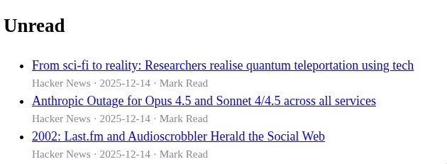

# newsyacht

An RSS/Atom feed reader with a web UI



## Installation

Install newsyacht with uv after the cloning the repository:

```shell
uv tool install .
```

or straight from GitHub:

```shell
uv tool install git+https://github.com/ntBre/newsyacht
```

## Usage

newsyacht reads a single `urls` file from the newsyacht directory in
`$XDG_CONFIG_HOME` (or `$HOME/.config`). To subscribe to newsyacht releases on
GitHub you could add a URL like this:

```shell
mkdir -p ~/.config/newsyacht
echo 'https://github.com/ntBre/newsyacht/releases.atom' > ~/.config/newsyacht/urls
```

The file should contain a single URL per line. Lines starting with `#` are
ignored.

Once you have a URL or two, run your first update with:

```shell
newsyacht update
```

Assuming that finishes successfully, you can either list the posts in the CLI:

```shell
newsyacht list
```

or, more likely, run the web server on `0.0.0.0:5000` with the `serve`
subcommand:

```shell
newsyacht serve
```

newsyacht doesn't have any self-updating functionality, so I recommend putting
an update command in a cron job, or similar, if you want automatic updates. For
example:

```shell
0 0 * * * /path/to/newsyacht update
```

would update the newsyacht database nightly at midnight.

## Limitations

I intended to list concrete limitations, but I guess it should just suffice to
say that this was a quick weekend project that's missing a lot of features and
polish but is already working for my usage, so I decided to share it. With that
said, feel free to give it a try and report any issues you run into!

## References

The name is a nod to [newsboat](https://newsboat.org/), a great terminal-based
RSS feed reader that I've been using for a few years. I just thought it would be
fun to write one of my own and put a different interface on it.
